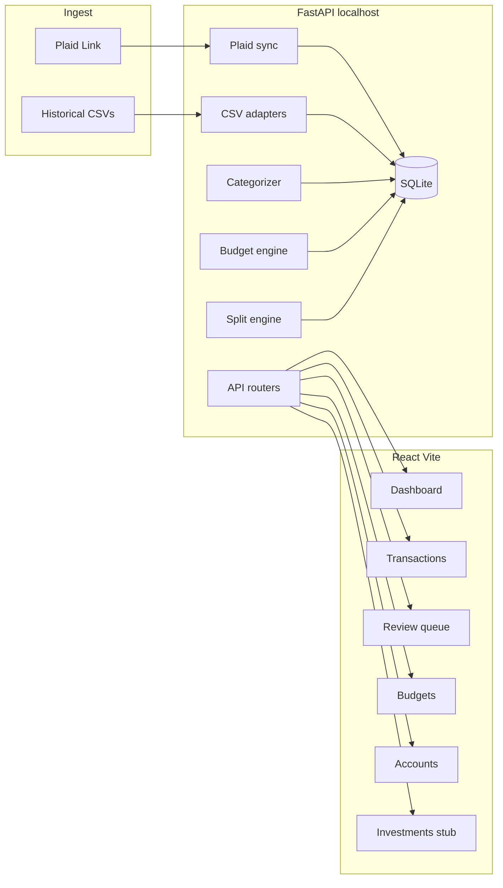
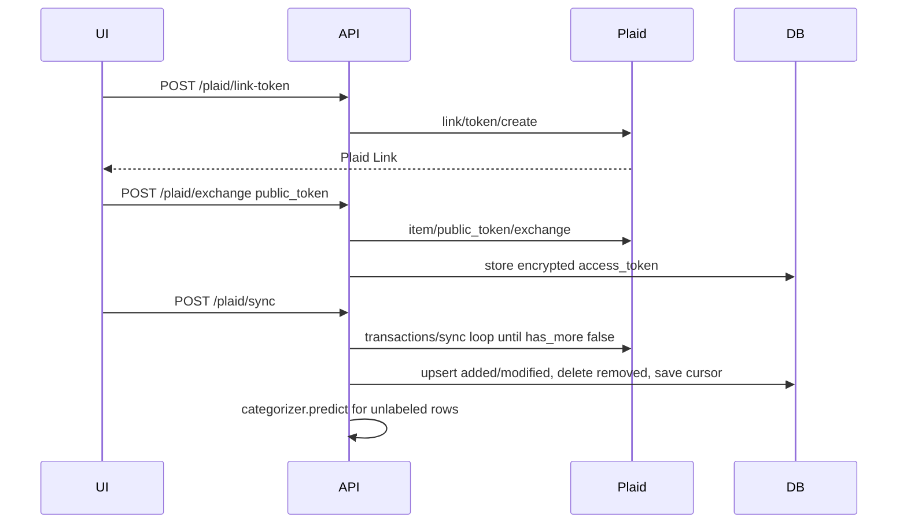

# Finance Tracker Architecture

Rebuild the repo as a **local-first web app** (FastAPI on `localhost:8000`, React on `localhost:5173`) with SQLite as the system of record. Keep household split (`Who`: A / S / shared) as a first-class field on every transaction, **editable at any time after import, sync, categorization, or report generation**. Treat Plaid as a live ingest source equivalent to monthly CSV activity exports — not PDF statements. Full investment tracking is the next product step; this pass ships **schema, API, and nav harnesses** so that work does not require a data-model rewrite.

## Current state (what we are replacing)

Today the product is a one-shot script plus a stale Plaid experiment:

- `[monthly_split_calculator.py](monthly_split_calculator.py)` reads a folder of CSVs, sums `Who` into A / S / shared, sums `Category`, prints JSON, and draws a matplotlib pie. It assumes one schema, flips Chase amounts by filename, and ignores empty `Who` as “both.”
- `[plaid_sandbox/plaid_integration.py](plaid_sandbox/plaid_integration.py)` uses the **deprecated** `plaid.Client` + `Transactions.get` API and hardcoded credentials. This file will be deleted, not extended.
- Real training data already exists outside the repo at `E:\finance\expense_tracking\` (~271 labeled files, 2025–2026). Four export dialects:

**Chase credit card** (`Chase1561_`*, `Chase9300_*`): `Transaction Date, Post Date, Description, Category, Type, Amount, Who` — expenses are **negative**.

**Chase bank / checking** (`Chase6009_`*): `Details, Posting Date, Description, Amount, Type, Balance, Category, Who` — outgoing is negative; includes mortgage, IRS, HOA.

**Amex** (`Amex1004_`*, `Amex2003_*`): `Date, Description, Card Member, Account #, Amount, Category, Who` — expenses are **positive**; refunds negative.

**Manual utilities** (`YYYY_MM_Home_Utilities.CSV`): `Date, Description, Amount, Who, Category, Note`.

`Who` values: `A` = Aprameya, `S` = Savanthi, **blank = shared**. Filenames encode institution + last-four (`Chase1561`, `Amex2003`).

## Target architecture




### Repository layout

```
finance_tracker/
  backend/
    app/
      main.py
      core/          config, encryption, logging
      db/            engine, session, models
      api/           FastAPI routers
      services/      plaid, csv adapters, categorizer, budget, split
      schemas/       Pydantic DTOs
    tests/
    pyproject.toml
  frontend/
    src/pages, src/components, src/api, src/theme
    package.json
  data/              finance.db, categorizer artifacts  (gitignored)
  .env.example
  monthly_split_calculator.py   thin CLI wrapper over backend services
```

Python stays the domain layer so existing pandas logic and Plaid’s official SDK remain in one place. The React app never holds Plaid `access_token`s.

## Data model (SQLite)

Canonical **amount sign**: **positive = money out** (spend), **negative = money in** (refund/credit). Matches Plaid and Amex; Chase CSVs are inverted on import.

`**txn_kind**` is required so card payments, transfers, and later brokerage cashflows do not inflate budgets:

- `spend` — purchases (budgeted)
- `refund` — returns/credits (reduce spend)
- `payment` — CC payment / loan payment (excluded from category spend)
- `transfer` — account-to-account
- `income` — deposits
- `investment_contribution` — cash to brokerage (e.g. existing Robinhood DEBIT rows); excluded from discretionary spend totals by default, still visible on the transaction list

`categories.include_in_budget` (bool, default true) so “Investments” can be seeded `false` without a special case in report math.

Core tables (cashflow — this pass, fully used):

- **`institutions` / `accounts`** — Chase/Amex/manual/brokerage; `last4`, `kind` (`credit` | `depository` | `manual` | `brokerage`), optional `plaid_account_id`
- **`plaid_items`** — `item_id`, **encrypted** `access_token`, `sync_cursor`, `status`, `products` JSON (v1 `["transactions"]`; later append `"investments"` without a new table). Tokens encrypted at rest with Fernet (`PLAID_TOKEN_KEY` in `.env`)
- **`categories`** — your taxonomy, seeded from distinct `Category` values in historical CSVs (e.g. Groceries, Restaurants, Subscriptions, Utilities, Mortgage, Health, Clothes, Gifts, Auto, Investments, Administrative, trip-specific Travel-* )
- **`transactions`** — `id`, `account_id`, `source` (`plaid` | `csv` | `manual`), `external_id` (Plaid `transaction_id` or CSV fingerprint), `date`, `description_raw`, `merchant_norm`, `amount`, `txn_kind`, `pending`, `category_id`, `who` (`A` | `S` | `shared`), `who_source` (`user` | `rule` | `model` | `imported`), `category_source` (`user` | `rule` | `model` | `plaid_map` | `imported`), `category_confidence`, `notes`, unique on `(account_id, external_id)`
- **`merchant_rules`** — `merchant_norm` → `(category_id, who)` with `hit_count`, `last_used`. This is the primary categorizer
- **`budgets`** — `year_month`, `category_id`, `limit_amount`. Optional `scope` (`household` | `A` | `S`) later; v1 is household monthly limits
- **`import_batches`** — CSV path, parser used, row counts, errors

Investment harness tables (created now, unused except empty API/nav; next step fills them):

- **`securities`** — `plaid_security_id`, `ticker`, `name`, `cusip`, `type` (equity, etf, mutual fund, crypto, cash)
- **`holdings`** — `account_id`, `security_id`, `quantity`, `cost_basis_cents`, `value_cents`, `as_of` (snapshot per sync)
- **`investment_transactions`** — distinct from cashflow `transactions`: buys, sells, dividends, fees, transfers; `plaid_investment_transaction_id`, `security_id`, `qty`, `price_cents`, `amount_cents`, `subtype`

Cash vs investments stay **sibling domains**: checking “Robinhood DEBIT” remains a cashflow row (`investment_contribution`); the brokerage lot/holding lives in `holdings` once Plaid Investments is enabled. Do not overload `transactions` with share quantities.

Dedup: Plaid uses `transaction_id`. CSV uses hash of `(account last4, date, amount, normalized description)`. Re-importing the same month is idempotent. Re-import **does not** clobber `who_source=user` or `category_source=user`.

## Ingest

### 1. CSV adapters (historical + fallback)

Replace the single `get_credit_card_csv()` in `[monthly_split_calculator.py](monthly_split_calculator.py)` with explicit parsers:

- `chase_credit` — detect `Transaction Date` + `Type`
- `chase_bank` — detect `Details` + `Balance` (**do not** apply the current Chase amount flip blindly)
- `amex` — detect `Card Member` + `Account #`
- `utilities_manual` — detect `Note` + filename `Home_Utilities`

Account identity comes from filename last-four, not from mixing all files into one DataFrame. Bulk import command: `POST /imports/directory` pointing at `E:\finance\expense_tracking` (or a settings path). This seeds transactions, categories, and merchant rules.

### 2. Plaid (live monthly pull)

Use **current** Plaid Python client (`2020-09-14` API): `/link/token/create` → frontend `react-plaid-link` → `/item/public_token/exchange` → `/transactions/sync` with stored cursor. **Do not** use `Transactions.get` or `public_key`.

Local-app constraint: no public webhook URL. Sync is **on-demand + optional interval** (UI “Sync accounts”, plus a backend scheduler every N hours while the API is running). Request `transactions.days_requested = 730` on Link so the first sync backfills ~2 years.

Flow:




Credentials only in `.env`: `PLAID_CLIENT_ID`, `PLAID_SECRET`, `PLAID_ENV` (`sandbox` for fake data, `production` for Chase/Amex). Sandbox cannot see real cards; Production access is required for live statements. Existing client id in `plaid_sandbox/` moves to env and that folder is removed.

Plaid `personal_finance_category` is a **feature**, not your label. Map it only when no merchant rule or model prediction exists, and still send those rows to the review queue.

Card **payments** from Plaid should land as `txn_kind=payment` so they do not double-count with checking outflows.

## Auto-categorization (and Who)

Goal: reuse years of your CSV labels so new Plaid (and new CSV) rows get `Category` + `Who` with a review path when unsure.

Pipeline, in order:

1. **Normalize merchant** — uppercase, strip `AplPay` / `Apple Pay` / store numbers / city+state suffixes (`ATLANTA GA`), collapse whitespace.
2. **Exact rule** — `merchant_rules` majority vote from labeled history (category **and** `who`). High confidence if one pair dominates.
3. **Fuzzy rule** — token overlap / RapidFuzz against known merchants if exact miss.
4. **Model fallback** — sklearn `TfidfVectorizer` + `LinearSVC` (or `CalibratedClassifierCV` for probabilities) trained on `merchant_norm + description_raw`. Separate classifiers for `category` and `who` (who includes `shared`). Persist vectors in `data/categorizer/`. Retrain after bulk import and after N new user corrections.
5. **Plaid map** — static mapping table from Plaid PFC primary → your category (e.g. `FOOD_AND_DRINK` → Restaurants, with grocery merchants still winning via rules).
6. **Review queue** — `confidence < 0.75` or no match. User inline-edit writes `category_source=user` and upserts `merchant_rules`.

Never overwrite `category_source=user` or `who_source=user`. Re-sync and re-import update amount/pending/date but not a human label.

## Split labels stay editable after analysis

Ingest, categorization, and monthly reports are **not a freeze**. `Who` is always mutable; settlement is **derived on read** from current labels (no stored snapshot that can go stale).

Backend:

- `PATCH /transactions/{id}` — `{ who?, category_id?, notes?, txn_kind? }`. Setting `who` writes `who_source=user`.
- `POST /transactions/bulk-who` — `{ ids[], who, update_merchant_rule?: bool }`. Optional checkbox: “remember this Who for this merchant.”
- Reports, dashboard, and budget APIs recompute from the live `transactions` table. No cache invalidation beyond TanStack Query refetch after PATCH.
- Categorizer / Plaid sync / CSV re-import skip rows with `who_source=user`.

Frontend (same control everywhere a split is shown):

- Transactions table: A / S / Shared segmented control per row, including months already “closed” in reports
- Reports page: settlement figures plus a drill-down list; changing Who there immediately refreshes A / S / shared totals and the Aprameya vs Savanthi share
- Review queue: Who is editable alongside category
- Dashboard split chips are links into the filtered transaction list, not static decorations

Imported CSV `Who` (including blank → `shared`) is `who_source=imported`, which **is** overridable. Only explicit UI/API edits become `user` and stick.

## Budgeting and exceedances

- User sets a **monthly limit per category** (household). Limits can copy forward from the previous month.
- Spend for a month = sum of `txn_kind in (spend, refund)` for posted (or posted+pending, UI toggle) transactions in that calendar month.
- Status: `ok` (<80%), `watch` (80–100%), `over` (>100%). Dashboard lists **exceedances** first (category, spent, limit, delta, % ).
- Split-aware later: filter spend by `who` without changing v1 household limits.

Parity check from the old script (category sum vs A+S+shared) becomes a backend invariant on the reports endpoint, not a print statement.

## Household split (kept)

Port `csv_subtotals` / share math into `services/split.py`:

- `A` spend, `S` spend, `shared` spend
- Settlement: `Aprameya = A + shared/2`, `Savanthi = S + shared/2` (same as current `int()` rounding unless we switch to cents-based round-half-even — **use integer cents** going forward to avoid float parity warnings)

Reports API: `GET /reports/month/{yyyy-mm}` returns category totals, split, budget vs actual, and parity delta — always from current `who` / category labels.

CLI `[monthly_split_calculator.py](monthly_split_calculator.py)` becomes a thin wrapper: import directory → print the same JSON. Matplotlib pie is dropped in favor of the UI chart.

## Investment tracking harness (this pass) / full feature (next step)

**This pass does not build portfolio charts, lot matching, or Plaid Investments sync.** It does make the next step additive:

- `accounts.kind` includes `brokerage` now so a future Robinhood/Fidelity/Vanguard Item does not require a migration of account types
- `plaid_items.products` is a list; Link token creation reads `PLAID_PRODUCTS` from env (default `transactions`). Next step adds `investments` (and optionally `liabilities`) without changing exchange/sync code paths for cashflow
- Stub tables `securities`, `holdings`, `investment_transactions` created with the initial migration
- `GET /investments/summary` returns `{ as_of: null, value_cents: 0, holdings: [] }` so the UI can bind
- `GET /investments/holdings` empty list; `POST /investments/sync` returns `501` with `{ "detail": "Plaid Investments not enabled" }` until the next step
- Frontend route `/investments` + nav item: empty state (“Holdings will appear here after brokerage accounts are linked”). Same dark theme, no fake data
- Cashflow rows categorized `Investments` or `txn_kind=investment_contribution` stay on the spending ledger; the budget engine already excludes them via `include_in_budget=false` / kind, so contribution double-counting is solved before holdings exist

Next-step implementation (not this pass): Plaid `/investments/holdings/get` + `/investments/transactions/get` (or Investments Sync when available), populate stub tables, cost basis vs market value, and a holdings dashboard. Same encrypted `access_token` if the Item was created with both products, or Link update mode to add `investments` to an existing Item.

## Frontend (React, local)

Stack: **Vite + React + TypeScript + Tailwind + TanStack Query + React Router + Recharts + react-plaid-link**.

Visual language (Robinhood numbers + Anthropic spacing):

- Near-black canvas (`#0B0D0C`), off-white type, one accent green (`#00C805`) for under-budget / money in, muted red for exceedances
- Large tabular figures, thin borders, dense transaction table, almost no chrome
- Inter or similar; generous padding on dashboard cards; no skeuomorphism

Pages:

1. **Dashboard** — selected month, total spend, split chips (A / S / shared) linking to filtered txns, budget exceedance list, category bars
2. **Transactions** — filters (account, category, who, search); inline category **and Who** edit at any time
3. **Review** — low-confidence queue (category + Who)
4. **Budgets** — category limits + progress
5. **Accounts** — connected Plaid items, last sync, “Link account”, CSV import
6. **Reports** — monthly split settlement (replaces CLI); Who still editable in the drill-down; totals live-update
7. **Investments** — harness empty state (next step fills holdings)
8. **Settings** — people labels, category list, `PLAID` not shown except env health

No auth for v1 (localhost-only). Bind API to `127.0.0.1`. CORS allow `http://localhost:5173` only.

## Security and config

- `.env` gitignored; `.env.example` documents keys
- Plaid tokens encrypted; never returned to the client
- SQLite file under `data/` gitignored (personal finance)
- Delete secrets from `[plaid_sandbox/plaid_integration.py](plaid_sandbox/plaid_integration.py)`

## Implementation sequence

Work in vertical slices so each step is usable:

1. **Scaffold** — backend + frontend workspaces, config, SQLite models including investment stub tables, health check
2. **CSV ingest + seed** — four adapters, import `E:\finance\expense_tracking`, populate categories and merchant rules
3. **Categorizer** — train on imported labels, predict + review API; preserve user Who/category
4. **Split edits** — PATCH + bulk Who, live reports, optional merchant-rule update
5. **Budgets + split reports** — limits, exceedances, settlement (old calculator logic, cents, on-read)
6. **Plaid** — Link, exchange, transactions/sync, map into the same transaction table + categorizer; `products` config for later investments
7. **UI** — theme + pages including Investments empty state; Who editable on transactions, review, and reports
8. **CLI wrapper** — keep `monthly_split_calculator.py` as a report printer; remove matplotlib as the primary UI

## Out of scope for this pass

Full investment tracking (holdings sync, lot P&L, brokerage charts), income dashboards, Excel export, public webhooks/ngrok, Tauri packaging, multi-user auth. The React app is structured so a later Tauri shell can wrap `localhost` without a data-model change. Investment **harnesses** above are in scope.